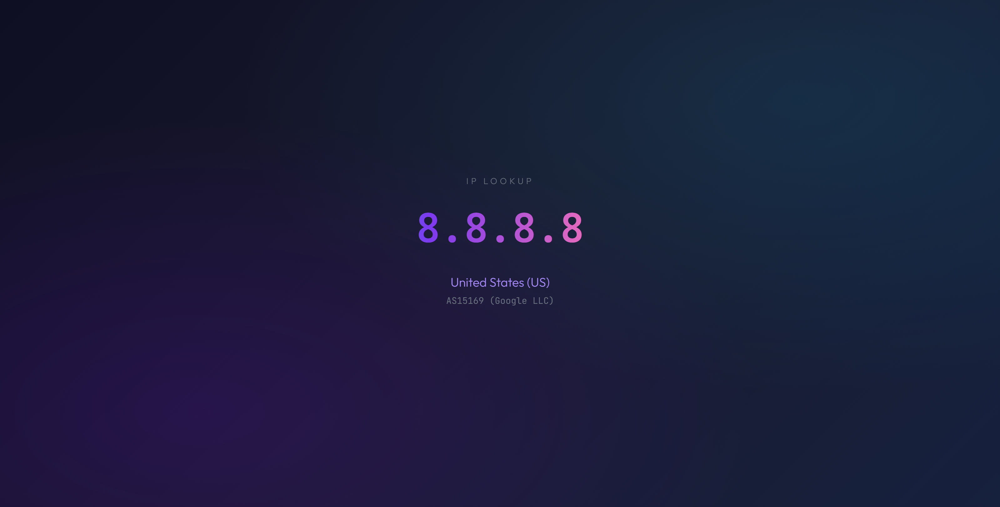

# beacon

A self-hosted "what's my IP" service. One endpoint returns the caller's public
IP address enriched with GeoIP data (city, country, ASN). The same URL serves a
styled web page to browsers and machine-readable output to everything else,
chosen automatically from the request's `User-Agent` and `Accept` headers.



## Features

- **One URL, three audiences.** Browsers get a Next.js page; `curl` gets plain
  text; clients sending `Accept: application/json` get JSON. No separate API
  path.
- **IP enrichment.** City, region, postal code, coordinates, accuracy radius,
  timezone and local time, continent, EU membership, anycast/proxy/satellite
  flags, and ASN (number + organization) — plus the caller's reverse-DNS
  hostname.
- **Multiple GeoIP sources, compared.** Two sources that need no account —
  DB-IP Lite and IPLocate — and two that need a free one, MaxMind GeoLite2 and
  IPinfo Lite (both optional), answer independently. Each is its own dataset
  rather than a repackaging of another, though all build on the same public
  registry and routing data; they differ in precision, from a city down to the
  country, and each says what it covers. Where they agree
  the output is unchanged; where they disagree every answer is shown and
  attributed. JSON always carries all of them. Beside them, the RIPE Database's
  own records give the country an address is registered to, across RIPE's
  region, and lead to the geofeeds in which networks publish where their own
  addresses are.
- **Versioned JSON.** The nested `version: 2` object is the default; the
  original flat shape is still available as `?v=1`.
- **Own TLS, optionally.** beacon can terminate TLS itself, obtaining and
  renewing certificates in-process over the ACME DNS-01 challenge, with no
  cron job and no second process.
- **TLS and HTTP/2 client fingerprints.** When beacon terminates TLS it reports
  JA3, JA3N and the four JA4 variants with the decoded ClientHello, and the
  Akamai HTTP/2 fingerprint with the client's opening frames — computed from
  the standard library and `x/net/http2`'s public API, with no forked TLS or
  HTTP/2 stack.
- **Arbitrary lookups.** `GET /` returns the caller's IP; `GET /{ip}` looks up
  any address.
- **Self-maintaining GeoIP data.** Databases are downloaded on first start and
  refreshed on a schedule, written to a temp file and installed atomically.
  Everything that can be verified is: MaxMind's, IPinfo's and IPLocate's files
  against the SHA-256 each publishes. DB-IP and RIPE publish nothing to check
  against. A source whose published data has not changed is not downloaded
  again. No database files live in the repo.
- **Zero-downtime refresh.** Database readers are hot-swapped under a lock; the
  service keeps answering during an update.
- **Hardened.** Non-root containers, static CGO-free Go binary, license key
  redacted from logs, archive size/member caps, graceful shutdown.
- **Plain HTTP by default.** Out of the box the stack speaks plain HTTP: expose
  it directly or front it with your own TLS-terminating proxy. Setting
  `TLS_ENABLED=true` makes beacon terminate TLS itself instead.

## Architecture

Three containers, defined in `docker-compose.yaml`:

| Container            | Image         | Role                                                              |
| -------------------- | ------------- | ----------------------------------------------------------------- |
| `beacon-backend`     | Go 1.25       | Entry point. IP detection, GeoIP lookups, routing, refresh loop.  |
| `beacon-frontend`    | Next.js 16    | The web page (App Router, standalone output). Internal `3000`.    |
| `beacon-init-volume` | `alpine:3.21` | One-shot: fixes ownership/permissions on the data volume.         |

Only the backend is published to the host: `${HOST}:${PORT}` maps to the
container's port 8000, and — when TLS is enabled — `${TLS_PUBLISH}` maps to
8443. The frontend is only reachable inside the compose network; the GeoIP
databases live on a named volume (`beacon-data`).

### Request routing

The backend decides who gets what, in this order:

Checked in this order — the first match wins:

| # | Request                                    | Goes to     |
| - | ------------------------------------------ | ----------- |
| 1 | `/_next/*`, `/favicon.ico`, `/logo.png`    | frontend    |
| 2 | `/healthz`                                 | health JSON |
| 3 | A browser navigation                       | frontend    |
| 4 | `?format=json` / `?format=text`            | that format |
| 5 | `Accept` contains `application/json`       | JSON        |
| 6 | Anything else (curl, wget, scripts, bots)  | plain text  |

Note rows 1 and 3 outrank the format controls: the app's own assets are always
served, and a browser navigation gets the page even when its `Accept` header
also lists JSON. `?format=` does suppress the page (row 3 defers to it), so
`?format=json` in a browser address bar returns raw JSON.

"A browser navigation" is decided by Fetch Metadata first. `Sec-Fetch-*` are
forbidden header names, so page JavaScript cannot forge them, and the browser
labels its own cases for us: a typed URL or followed link is
`Sec-Fetch-Dest: document`, while the page's own `fetch()` for JSON is
`Sec-Fetch-Dest: empty`. That is exactly the distinction needed here.

Browsers that predate Fetch Metadata (Safari before 16.4) fall back to
`User-Agent` plus an explicit appetite for HTML. Known bots, crawlers, link
unfurlers and HTTP libraries are excluded first, because many of them
advertise a browser-shaped `User-Agent`; they get the data, which is what
they actually want.

The page is itself a backend client: it fetches its own pathname with
`Accept: application/json` and renders the result. A browser hitting `/8.8.8.8`
loads the page, which then calls the backend for that IP's data.

### Client IP

With `TRUST_PROXY_HEADERS=true` (the default) the backend resolves the caller's
address in this order:

1. The **last** entry of `X-Forwarded-For`. Proxies append the peer they saw,
   so the last hop is the address the nearest proxy actually observed. Earlier
   entries may have been supplied by the caller and are ignored.
2. `X-Real-IP`, if it parses as an address. Only a fallback: it is a single
   value that proxies *set* rather than append, and one that does not set it —
   Caddy's `reverse_proxy` does not — passes the client's own value straight
   through.
3. The connection peer.

Preferring the appended chain is what makes this safe: a caller sending
`X-Forwarded-For: 1.2.3.4` gets `1.2.3.4, <their real address>` appended by the
proxy and the real address still wins, and a caller sending `X-Real-IP` cannot
override that chain.

This works out of the box behind Caddy or nginx, neither of which needs extra
header configuration. **It is only safe if beacon is unreachable except through
that proxy** — bind it to loopback (`HOST=127.0.0.1`).

**Set `TRUST_PROXY_HEADERS=false` when beacon is exposed directly.** Otherwise
any caller can send the header and be told about an address that is not theirs.

With `PROXY_PROTOCOL=true` this is handled automatically: the PROXY header
carries the real client address at the TCP layer, so forwarded headers on that
listener — which come from the client, inside its own TLS session, and are
therefore attacker-controlled — are stripped before routing. You do not need to
change `TRUST_PROXY_HEADERS` for the TLS listener.

## API

### Endpoints

- `GET /` — data for the caller's IP.
- `GET /{ip}` — data for the given IP.

### Content negotiation

`?format=json` or `?format=text` forces a representation. Otherwise an `Accept`
containing `application/json` gets JSON and everything else gets plain text.
Lookups and errors set `Cache-Control: no-cache, must-revalidate`; `/healthz`
sets `no-store`. Responses proxied from the frontend carry whatever Next.js
sets.

### JSON

Missing values are `null` throughout — never `0` or `""`. Top-level
`location` / `network` / `flags` come from the first source, so a simple client
can ignore `sources` entirely. `sources` carries the complete answer from
every provider **that had data for the address** — a provider with no record is
omitted rather than listed empty, so an absent name means either "no data" or
"not enabled". `sources_agree` says whether the listed ones matched, and
`locations_agree` / `networks_agree` are its two halves. They are split because
sources often agree on where an address is while naming different autonomous
systems for it: routing data against registry data.

Agreement is semantic, not textual. Sources are compared on the autonomous
system *number*, so "GOOGLE" against "Google LLC" is not a disagreement, and on
the country *code*, so two spellings of one country are not one either, and on
place names without case or accents,
so a geofeed's plain-ASCII "Malmo" agrees with "Malmö". A source that knows only the country is
treated as a coarser answer that folds into a more specific one rather than as a
conflict. Top-level fields are filled per field from the first source that has
each one, so a source knowing only the ASN does not blank out a city another
source knows. The place is kept whole, though: the first source to name a
country settles it, and the rest of the location is taken only from sources that
agree, so the top level never pairs one source's city with another's country.

Each entry in `sources` also lists what that source `provides`: the fields it
can fill for any address, by the keys used here (`region` covers the
subdivisions, `coordinates` latitude and longitude, `timezone` the local time).
A `null` or `false` from a source that provides the field is its answer. From
one that does not, it means nothing either way: DB-IP Lite has no postal code
for any address, and IPLocate has no city.

Geofeeds give the region as a code alone, so their `region` is `null` beside a
`region_code`, and a subdivision's `name` can be `null` for the same reason.

`registered_country` is where an address is registered, not where it is: the
holder's country in the registry, which for a VPN or a leased range can be far
from anyone using it. MaxMind provides it, and RIPE provides nothing else — as a
code alone, which the top level names the way the other sources name that
country. It takes no part in `locations_agree`.

```
$ curl -s -H 'Accept: application/json' http://localhost/203.0.113.17
{
  "version": 2,
  "ip": "203.0.113.17",
  "family": "ipv4",
  "hostname": "host-17.example.net",
  "location": { "city": "Hong Kong", "region": "Central and Western District",
                "region_code": null, "subdivisions": [ ... ], "postal_code": null,
                "country": "Hong Kong", "country_code": "HK",
                "continent": "Asia", "continent_code": "AS",
                "in_european_union": false,
                "registered_country": null, "registered_country_code": null,
                "latitude": 22.2833, "longitude": 114.15,
                "accuracy_radius_km": null,
                "timezone": "Asia/Hong_Kong",
                "local_time": "2026-09-21T20:23:00+08:00",
                "metro_code": null },
  "network": { "asn": 9304, "asn_org": "HGC Global Communications Limited",
               "asn_label": "AS9304 (HGC Global Communications Limited)" },
  "flags": { "anycast": false, "anonymous_proxy": false, "satellite_provider": false },
  "sources_agree": false,
  "locations_agree": false,
  "networks_agree": false,
  "sources": [
    { "source": "MaxMind", "provides": [ "city", "region", ... ],
      "location": { ... }, "network": { ... }, "flags": { ... } },
    { "source": "DB-IP", "provides": [ "city", "region", "coordinates", ... ],
      "location": { ... }, "network": { ... }, "flags": { ... } },
    { "source": "IPLocate", "provides": [ "country", "continent", "asn", "asn_org" ],
      "location": { ... }, "network": { ... }, "flags": { ... } }
  ]
}
```

Every entry in `sources` has the same shape as the top-level
`location` / `network` / `flags` trio — a full record, not a diff — and keeps
the source's own spelling of every name.

`latitude`/`longitude` are `null` when a source has no location for the
address, which is distinct from a genuine `0, 0`.

#### Legacy shape

```
$ curl -s -H 'Accept: application/json' 'http://localhost/8.8.8.8?v=1'
{"ip":"8.8.8.8","city":"Mountain View","country":"United States","country-code":"US","asn":"AS15169 (Google LLC)"}
```

### Plain text

Space-joined `IP [City] [[CC] Country] [ASN]`, with absent parts omitted. It
stays a single line — it is what `curl beacon` prints, and scripts parse it.

When every source agrees there is nothing to attribute, so the line is exactly
what it always was:

```
$ curl -s http://localhost/8.8.8.8
8.8.8.8 Mountain View [US] United States AS15169 (Google LLC)
```

When sources disagree, each distinct answer carries the sources that reported
it, and the alternatives are separated by ` / `. Location and ASN are grouped
independently, so a disagreement about one does not clutter the other. A
country is written with the first source's name for its code; a code no source
names is shown bare, `[RU]`:

```
$ curl -s http://localhost/203.0.113.42
203.0.113.42 Dnipro [UA] Ukraine [MaxMind] / Chernivtsi [UA] Ukraine [DB-IP] AS21497 (PrJSC "VF UKRAINE")

$ curl -s http://localhost/203.0.113.17
203.0.113.17 Hong Kong [HK] Hong Kong [MaxMind] / London [GB] United Kingdom [DB-IP] AS9304 (HGC Global Communications Limited) [MaxMind] / AS213520 (Senko Digital LLC) [DB-IP]
```

### Errors

| Case                                     | Status | Body                                     |
| ---------------------------------------- | ------ | ---------------------------------------- |
| String shaped like IPv4 but out of range | `400`  | `{"detail":"Invalid IP address"}`        |
| Not an IP address at all                 | `404`  | `{"detail":"Invalid IP address format"}` |

## Configuration

Settings are environment variables. Copy `example.env` to `.env`; compose reads
it. Nothing is required: beacon runs on the sources that need no account.
Misconfiguration is rejected at startup rather than at the first request.

| Variable                      | Required | Default   | Description                                                       |
| ----------------------------- | -------- | --------- | ----------------------------------------------------------------- |
| `DBIP_ENABLED`                | no       | `true`    | Use DB-IP Lite. No account required.                              |
| `IPLOCATE_ENABLED`            | no       | `true`    | Use IPLocate's IP-to-Country and IP-to-ASN. No account required.  |
| `RIPE_ENABLED`                | no       | `true`    | Use RIPE's registered countries. No account; locates nothing.     |
| `GEOFEEDS_ENABLED`            | no       | `true`    | Use the operators' geofeeds RIPE's records link to. Needs RIPE.   |
| `MAXMIND_ACCOUNT_ID`          | no       | —         | MaxMind account ID. Set together with the license key, or neither.|
| `MAXMIND_LICENSE_KEY`         | no       | —         | MaxMind license key.                                              |
| `IPINFO_TOKEN`                | no       | —         | IPinfo token; enables IPinfo Lite. The token alone, not the URL.  |
| `GEOIP_UPDATE_INTERVAL_HOURS` | no       | `12`      | How often the backend checks for / downloads fresh databases.     |
| `HOST`                        | no       | `0.0.0.0` | Host interface the backend is published on.                       |
| `PORT`                        | no       | `80`      | Host port the backend is published on (mapped to `8000`).         |
| `TRUST_PROXY_HEADERS`         | no       | `true`    | Believe an inbound `X-Real-IP`. Set `false` when exposed directly.|
| `RDNS_ENABLED`                | no       | `true`    | Resolve the PTR record of the address being looked up.            |
| `RDNS_TIMEOUT_MS`             | no       | `300`     | Per-lookup reverse-DNS timeout.                                   |
| `RDNS_CACHE_TTL_SECONDS`      | no       | `3600`    | How long reverse-DNS results are cached.                          |
| `FRONTEND_URL`                | no       | `http://frontend:3000` | Next.js upstream. Empty disables the page entirely. |
| `LISTEN_ADDR`                 | no       | `:8000`   | Address the backend binds inside the container.                   |
| `TLS_ENABLED`                 | no       | `false`   | Terminate TLS in beacon.                                          |
| `DOMAIN`                      | if TLS   | —         | Comma-separated names to obtain certificates for.                 |
| `CF_API_TOKEN`                | if TLS   | —         | Cloudflare API token with `Zone:Read` + `Zone.DNS:Write`.         |
| `CF_ZONE_TOKEN`               | no       | —         | Optional separate `Zone:Read` token, to scope the one above.      |
| `ACME_EMAIL`                  | no       | —         | Contact address for expiry notices.                               |
| `ACME_CA`                     | no       | production| `staging` while testing — production has strict rate limits.      |
| `TLS_LISTEN_ADDR`             | no       | `:8443`   | Address the TLS listener binds inside the container.              |
| `TLS_PUBLISH`                 | no       | unpublished | Host mapping for the TLS port, e.g. `127.0.0.1:8443:8443`.      |
| `PROXY_PROTOCOL`              | no       | `false`   | Read a PROXY protocol header before the TLS handshake.            |

A free MaxMind GeoLite2 account provides the account ID and license key, and a
free IPinfo account the token — the value after `token=` in the download link
its dashboard shows. Both are worth adding as further opinions, but beacon
works without either.

### Reverse DNS

`GET /{ip}` resolves the PTR record of the address being looked up, which means
a caller chooses the destination of an outbound DNS query. Lookups are capped
at 32 concurrent, deduplicated so a burst for one address makes one query, and
cached — including failures. Over the cap a lookup is skipped rather than
queued, and `hostname` comes back `null`. Set `RDNS_ENABLED=false` to turn it
off entirely.

## TLS fingerprints

With `TLS_ENABLED=true` the JSON response carries a `tls` block:

```json
"tls": {
  "ja3": "771,4867-4866-...,43-51-0-11-10-13-16,29-23-24-25,0",
  "ja3_hash": "375c6162a492dfbf2795909110ce8424",
  "ja3n": "...", "ja3n_hash": "90a369ebd76665d3296677774ee22ea2",
  "ja4":    "t13d4907h2_0d8feac7bc37_7395dae3b2f3",
  "ja4_r":  "t13d4907h2_0004,0005,...,ff85_000a,000b,000d,002b,0033_0806,...",
  "ja4_o":  "t13d4907h2_2677ac475d6b_c6f9150fbe3b",
  "ja4_ro": "t13d4907h2_1303,1302,...,00ff_002b,0033,0000,...,0010_0806,...",
  "client_hello": {
    "version": "TLS 1.3",
    "cipher_suites": ["0x1303", "0x1302", ...],
    "extensions": ["0x002b", "0x0033", ...],
    "supported_versions": [...], "supported_groups": [...],
    "point_formats": [0], "signature_algorithms": [...],
    "alpn": ["h2", "http/1.1"],
    "server_name": "beacon.example.com",
    "grease": false,
    "truncated": false
  },
  "negotiated": {
    "version": "TLS 1.3", "cipher_suite": "TLS_AES_128_GCM_SHA256",
    "key_exchange": "X25519MLKEM768", "alpn": "h2",
    "resumed": false, "ech_accepted": false
  }
}
```

The block is `null` in plain-HTTP mode, and `?v=1` never carries it.

`truncated` is `true` for a ClientHello far larger than any real client sends —
the hashes still cover everything the client offered, but the decoded lists and
the unhashed `ja3`/`ja4_r` forms are withheld rather than held in memory for
the life of the connection. The same reasoning bounds the HTTP/2 side: a client
that floods SETTINGS or PRIORITY frames is dropped from fingerprinting instead
of being accumulated.

An HTTP/2 request also carries an `http2` block:

```json
"http2": {
  "akamai": "3:100;4:10485760;2:0|1048510465|0|m,s,a,p",
  "akamai_hash": "64a832f547be33249bf4d33e8a46c5dc",
  "settings": [{"id": 3, "value": 100}, {"id": 4, "value": 10485760}, {"id": 2, "value": 0}],
  "window_update": 1048510465,
  "priorities": [],
  "pseudo_header_order": ["m", "s", "a", "p"]
}
```

The four fields are the client's SETTINGS in the order sent, its initial
connection-level WINDOW_UPDATE, any PRIORITY frames, and the order of the
pseudo-headers in its first request. It is `null` for HTTP/1.1.

Clients differ more than you might expect: curl sends
`3:100;4:10485760;2:0|1048510465|0|m,s,a,p`, while Go's own HTTP/2 client
sends `2:0;4:4194304;5:16384;6:10485760|1073741824|0|a,m,p,s` — different
settings, different values, and pseudo-headers in alphabetical order rather
than the usual method/scheme/authority/path.

`ja3` and `ja4` use the client's wire order; `ja3n` and `ja4` sort what they
hash, which is what makes them survive Chrome's per-connection extension
permutation. `ja4_o` and `ja4_ro` keep the wire order on purpose, so the two
forms together show whether a client permutes. GREASE values (RFC 8701) are
excluded from every fingerprint — they are random per connection — but their
presence is reported as `client_hello.grease`.

The TLS side comes from `tls.ClientHelloInfo`, which the standard library
fills with the cipher suites, the extension IDs **in wire order**, the
supported groups, the signature algorithms and the offered ALPN protocols
exactly as sent. No third-party TLS stack and no raw ClientHello capture is
involved.

The HTTP/2 side is usually done by forking `golang.org/x/net/http2` to reach
its frame loop. That is not necessary either: `http2.Server.ServeConn` is
public and accepts any `net.Conn`, so a connection wrapper reads the opening
frames on their way past and hands the real server an untouched stream. HTTP/2
is configured exactly as the library would have done it, then its ALPN entry
is swapped for the wrapping one, so every limit and timeout is unchanged.

JA3 is Salesforce's and JA4 is FoxIO's, BSD-3-Clause licensed. The rest of the
JA4+ suite is under a non-commercial licence that is incompatible with this
project's AGPL-3.0, so none of it is implemented here.

### Why this needs beacon to own the TLS endpoint

Fingerprints are computed from the ClientHello, which a TLS-terminating proxy
consumes and discards. No header recovers it downstream. That is why the `tls`
block is absent unless `TLS_ENABLED=true`, and why the documented Caddy setup
passes the connection through rather than terminating it.

## Health

`GET /healthz` returns `{"status":"ok","sources":[...]}` once the service is
serving. The container healthcheck runs the binary's own `-healthcheck` flag
against it, because the runtime image has no shell tools.

Databases already on the volume are opened before the listener opens. Missing
ones download in the background, and each source starts answering once its
download is done, so enabling a source never takes the service down. Only a
first start with an empty volume waits, since nothing could answer yet: one
source downloads before the listener opens — typically a few seconds — and the
rest follow in the background. The compose healthcheck allows for that with a
`start_period`; `docker compose up -d` followed immediately by `curl` may get a
connection refused until it finishes. With `TLS_ENABLED=true` the ACME exchange
also completes before either listener opens.

## Quick start

```sh
cp example.env .env
docker compose up -d --build
```

No credentials are needed to start: the no-account sources are downloaded on
first run — about 520 MB, of which RIPE's 260 MB is read as it streams and not
kept, and 350 MB on the data volume. Watch it come up with
`docker compose logs -f backend`, or wait for the container to report healthy.

With the default `HOST=0.0.0.0` / `PORT=80`:

```sh
curl -s -H 'Accept: application/json' http://localhost/
curl -s http://localhost/1.1.1.1
```

Open `http://localhost/` in a browser for the page (it sends a browser
`User-Agent` and `Accept: text/html`, so it is routed to the frontend; bare
`curl` gets plain text).

## GeoIP data

Each source manages its own files in the data volume and downloads them on
first start if they are missing. A background loop looks over every source
every 15 minutes and refreshes each one whose `.timestamp` marker is older than
`GEOIP_UPDATE_INTERVAL_HOURS`, so every source keeps to that interval on its own
clock. A source may impose a longer floor: DB-IP publishes monthly, so it is
never checked more than once a day however low the interval is set. Every
source has a cheap way to ask whether anything changed — a checksum, a HEAD
request or a conditional GET — and a check that finds nothing new downloads
nothing.

Every source here is its own dataset. Services that repackage one beacon
already reads — RIPEstat's geolocation is MaxMind's, and several projects
republish GeoLite2 and DB-IP — are deliberately not used. IPFire Location and
ip-location-db were used and dropped for the same reason: their country is the
registries' records and the operators' geofeeds, which the RIPE and Geofeeds
sources read first-hand. Compared over a million addresses, IPFire's country
matched RIPE's registration 99.1% of the time, and ip-location-db matched the
geofeeds 99.7% of the time wherever a feed answered.

**DB-IP Lite** — City and ASN, free, no account, CC-BY 4.0, published monthly
at a month-stamped URL. beacon asks for the current month and falls back to the
previous one when the new files are not out yet. A HEAD request says which
release is published, and each installed file carries its release's
`Last-Modified` as its modification time, so a month's files are downloaded
once rather than every day.

**MaxMind GeoLite2** — Country, City and ASN, fetched from MaxMind's
permalinks with the account ID and licence key as HTTP basic auth, streamed
while hashing, SHA-256–checked against MaxMind's published checksum. City and
Country are rebuilt twice a week and ASN most days, and every download counts
against the account's daily limit, so each refresh first asks with a HEAD
request — which MaxMind does not count — and downloads only the editions whose
build has moved. Archives are capped at 64 members and 512 MiB per database.

**IPinfo Lite** — country, continent and autonomous system from IPinfo's own
measurement network, free with an account, CC BY-SA 4.0, rebuilt daily. IPinfo
allows ten downloads a day per address; its checksum endpoint is free, so a
refresh asks it first and downloads only a database whose SHA-256 moved, then
verifies it against that.

Both answer a download with a redirect to signed storage elsewhere. MaxMind's
licence key travels in the `Authorization` header, which Go does not forward to
another host. IPinfo's token rides in the query string, and Go would pass the
original URL along as the redirected request's `Referer`; beacon's client drops
it, so the token never reaches the storage host, and it is redacted from every
logged URL and error.

**IPLocate** — IP-to-Country and IP-to-ASN (the ASN records also carry the
network's organisation), free, no account, CC BY-SA 4.0, rebuilt daily. They
are published through Git LFS, so the pointer file in the repository carries
each database's SHA-256 and size: one small request says whether anything
changed, and anything downloaded is checked against it.

**RIPE Database** — the country each address block is registered to, from the
registry's own records for its region: Europe, the Middle East and Central
Asia. Free, no account, published daily. It is reported as
`registered_country`, beside MaxMind's, and never as a location: RIPE's
documentation says the attribute may be the holder's head office, a server
centre or the end user, and "cannot be used in any reliable way to map IP
addresses to countries". Where blocks nest, the innermost one answers, and a
block registered to the whole region ("EU") answers with no country. The
`inetnum` and `inet6num` dumps, 223 MB and 38 MB compressed, are streamed and
reduced as they arrive to an index of about 3.5 MB, which is all that is kept; a
rebuild takes a few seconds and about 70 MiB of memory. Two HEAD requests say
whether either dump has moved, so an unchanged day downloads nothing. RIPE
publishes no checksum: HTTPS, gzip's own CRC and a floor on how many blocks a
real dump holds stand between a broken download and the index. The dumps are
subject to the
[RIPE Database Terms and Conditions](https://docs.db.ripe.net/HTML-Terms-And-Conditions).

**Geofeeds** — where networks say their own addresses are: the geofeed files
(RFC 8805) that operators publish and link from their blocks in the RIPE
Database (RFC 9632), a country, region and usually a city for each of their
ranges. The commercial databases fold these into their own data; this is the
same word first-hand. The RIPE source's daily reading of the database lists the
links — about 75,000 blocks linking 4,600 files — so this source needs RIPE on.
The first pass fetches them all, a few minutes and about 100 MB kept on disk;
after that a pass asks only for the feeds that are due. A feed is believed only
for the addresses of the block that links it, and not where a more specific
block links a feed of its own — without that, anyone could publish a location
for anyone's addresses. Each feed is kept on disk and fetched on its own
schedule, weekly or as its publisher's `Expires` or `max-age` says, with a
conditional request, as RFC 9632 asks of collectors; a feed that fails keeps
its last good copy for up to a month. Feeds are fetched over HTTPS only and
only from public addresses: the links come from records anyone can create, and
one pointing at this host's own network is refused. Feeds carry no licence of
their own: publishing one is how a network asks location services to use it.

IPinfo's and IPLocate's files are MMDB with flat records
rather than the GeoIP2 layout, and are read with `maxminddb-golang` directly:
`geoip2-golang` opens them without complaint and returns an empty record for
every address.

Every database is written to a temp file and only then renamed into place, and
readers are swapped under a lock, so a lookup never sees a half-written file
and the service keeps answering during an update. A source that is not
answering — its first download still to come, or failed — is set aside rather
than taking the service down, and brought up by the loop. A failure, of a first
download or a refresh, is logged and tried again after a wait: 15 minutes,
doubling with each failure after that up to the refresh interval, so a source
that is down is not asked four times an hour; the readers already open keep
serving meanwhile. Files on the volume that will not open are downloaded again
rather than left to keep their source down.

Within a source: ASN is always attempted; the City database supplies location
when it has any, otherwise the Country database supplies the country alone.
DB-IP ships no separate Country edition — its City database already carries
country data — so that fallback applies to MaxMind only.

## TLS

By default beacon speaks plain HTTP and you put your own TLS in front of it.

Setting `TLS_ENABLED=true` makes beacon terminate TLS itself. Certificates come
from ACME over the **DNS-01** challenge via Cloudflare, so nothing needs to
reach beacon to prove ownership — no port 80, no inbound connection. CertMagic
keeps them renewed in-process and swaps them into the running config without a
restart, so there is no cron job and no second process. State lives in the
existing data volume.

This matters for what comes next: TLS fingerprints are computed from the raw
ClientHello, and **a proxy that terminates TLS consumes it — it cannot be
recovered downstream.** To fingerprint, beacon has to own the TLS endpoint.

### Behind an existing reverse proxy

If something already holds `:443` on the host, it must pass the connection
through rather than terminate it. With Caddy that is the `layer4` listener
wrapper — note it attaches to Caddy's *existing* listener, so there is no
second bind on `:443`:

**`layer4` is a third-party module and is not in the stock Caddy binary.** A
distribution package, the official Docker image or a downloaded release will
reject the config below as an unknown module, and because it is a global
options block `caddy reload` refuses the whole file — your other sites keep
running on the old config and beacon never comes up. Build Caddy with it first:

```bash
xcaddy build --with github.com/mholt/caddy-l4
```

(It is also selectable in the plugin picker on caddyserver.com/download if you
would rather not install a Go toolchain.)

```caddyfile
{
    servers :443 {
        # A listener wrapper is TCP-only, and HTTP/3 is on by default. Without
        # this, a QUIC connection bypasses the wrapper entirely and beacon
        # never sees it. Note this disables HTTP/3 for *every* site on this
        # server, not just beacon — that is a real cost, not a free precaution.
        protocols h1 h2

        listener_wrappers {
            layer4 {
                @beacon tls sni beacon.example.com
                route @beacon {
                    proxy {
                        proxy_protocol v2
                        upstream 127.0.0.1:8443
                    }
                }
            }
            tls          # everything else terminates here, unchanged
        }
    }
}
```

Set `PROXY_PROTOCOL=true` to match. A TCP-level proxy opens a new connection to
beacon, so without it every visitor would be reported as the proxy.

Things to get right — the first three fail *silently*, and `caddy validate`
reports "Valid configuration" for all of them:

- **`servers :443` is matched as a literal string, not as an address.** If your
  sites use `bind`, the server's listen address becomes `10.0.0.5:443` and this
  block is skipped with no warning and no `listener_wrappers` key in the
  adapted config. Run `caddy adapt` and confirm `listener_wrappers` actually
  appears on the `:443` server before reloading.
- **The bare `tls` line is mandatory and must come after `layer4`.** It is a
  no-op placeholder marking where TLS termination belongs in the chain. Omit it
  and Caddy silently prepends it, so `layer4` runs *after* termination and sees
  decrypted bytes — the `tls sni` matcher then never matches anything. Putting
  it first is at least a loud error.
- **If you already have a `servers :443` block, merge into it.** A second one is
  a hard error, and `listener_wrappers` is assigned wholesale, so every wrapper
  has to be in one chain.
- Remove any site block for beacon's domain. Once layer4 matches its SNI the
  block is unreachable, and Caddy could never answer a TLS-ALPN-01 challenge for
  that name — the connection is diverted before its TLS listener. Other
  hostnames are unaffected.
- **Every connection on `:443` now gets layer4's 3-second matching deadline**,
  including your other sites'. A client that connects and does not send a
  ClientHello within 3s is dropped — TCP health checks that never handshake,
  and slow mobile clients. Raise it with `matching_timeout` inside the `layer4`
  block if that matters.
- Keep beacon's TLS port on loopback, and set `TLS_PUBLISH=127.0.0.1:8443:8443`
  so it is published on a *fixed* port — left unset, compose picks a random one
  and the `upstream` above dials a closed port. With `PROXY_PROTOCOL=true`
  beacon requires the header, so a direct connection is refused rather than
  misattributed, but there is no reason to expose it at all.

This arrangement is verified: a ClientHello replayed through it arrives at
beacon byte-identical (sha256 match) behind a 28-byte PROXY v2 header carrying
the real client address, which is what makes the fingerprints meaningful.

## Project layout

```
backend/                  Go service
  main.go                 HTTP server, content negotiation, frontend proxy
  internal/config         env config and validation
  internal/browser        navigation vs. tool detection (Fetch Metadata, UA)
  internal/geoip          providers, registry, refresh loop, mmdb readers, RIPE and geofeed indexes
    testdata/mmdbgen      writes the test .mmdb fixtures; its own module
  internal/rdns           bounded, cached reverse-DNS lookups
  internal/render         JSON (v1/v2) / plain-text response shaping
  internal/h2fp           Akamai HTTP/2 fingerprint, frame capture
  internal/tlsfp          JA3/JA4 fingerprints, ClientHello capture
  internal/tlsserve       ACME DNS-01 certificates, TLS + PROXY listener
frontend/                 Next.js 16 app (App Router, TypeScript, standalone output)
  DESIGN.md               the design system; read before changing any UI
  CLAUDE.md               stack, rules, why the fetch is client-side
  app/page.tsx            "/" route
  app/[ip]/page.tsx       "/{ip}" route
  app/beacon-view.tsx     client component: fetch, hero, the scrolled readout
  app/components/         rows, and the fingerprint breakdowns
  app/api/mock/           development fixture API (404s unless explicitly enabled)
  proxy.ts                development content negotiation, mirroring the backend
  lib/types.ts            the v2 response, nullability included
docker-compose.yaml       the three-container stack
.github/workflows         SSH deploy
```

## Attribution

This product includes GeoLite2 data created by MaxMind, available from
[maxmind.com](https://www.maxmind.com).

IP geolocation by [DB-IP](https://db-ip.com), licensed under
[CC BY 4.0](https://creativecommons.org/licenses/by/4.0/).

IP address data powered by [IPinfo](https://ipinfo.io), licensed under
[CC BY-SA 4.0](https://creativecommons.org/licenses/by-sa/4.0/).

IP address data powered by [IPLocate.io](https://www.iplocate.io), licensed
under [CC BY-SA 4.0](https://creativecommons.org/licenses/by-sa/4.0/).

Registration data from the
[RIPE Database](https://www.ripe.net/manage-ips-and-asns/db/), subject to the
[RIPE Database Terms and Conditions](https://docs.db.ripe.net/HTML-Terms-And-Conditions),
and locations networks publish as [geofeeds](https://www.rfc-editor.org/rfc/rfc8805),
found through it.

Every notice also appears in the page's footer, which is where the licences
require them: attribution is owed to the people using the service, not only to
people reading the repository. beacon answers lookups from the databases; it
does not redistribute the databases themselves.

## License

AGPL-3.0. See [LICENSE](LICENSE).

Because beacon is run as a network service, AGPL-3.0 section 13 applies: the
complete source has to be offered to the people interacting with it. The page
footer links to this repository and every response carries an `X-Source-Code`
header. **If you modify beacon and run it, both of those must point at your
source**, not this one — `SOURCE_URL` in `frontend/app/beacon-view.tsx` and
`sourceURL` in `backend/main.go`.

The JA4 TLS client fingerprint is FoxIO's work under a separate BSD-3-Clause
grant; see [LICENSE-JA4](LICENSE-JA4), which also explains why the rest of the
JA4+ suite is not implemented here and must not be added.
